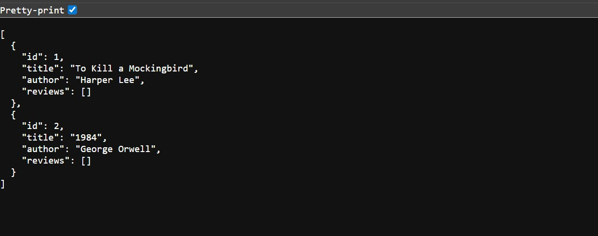
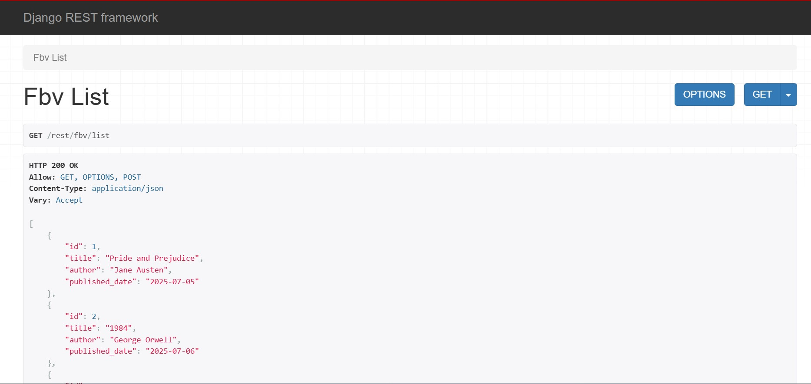
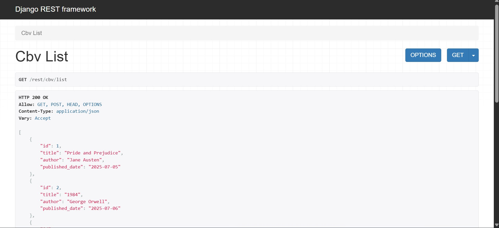
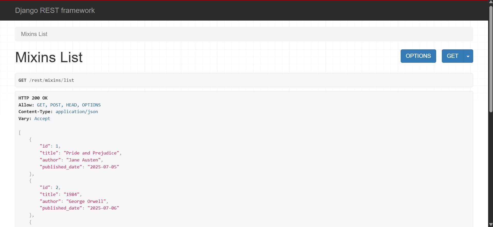
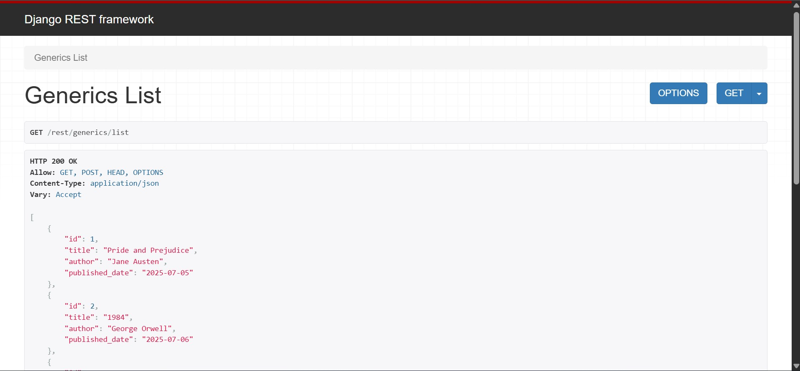

# 📚 ViewsStrategies - Django REST API Educational Project

A comprehensive educational project demonstrating **7 different approaches** to building REST APIs in Django and Django REST Framework. Perfect for developers who want to understand the evolution and various patterns of API development in Django.








## 🎯 Project Overview

**ViewsStrategies** is designed to help developers understand the different ways to build REST APIs in Django, from basic pure Django approaches to advanced Django REST Framework patterns. Each implementation handles the same data models but uses different architectural patterns, allowing for direct comparison of code complexity, features, and best practices.

### 🎓 Educational Purpose

This project serves as a:
- **Learning resource** for Django and DRF developers at all levels
- **Comparison guide** showing pros and cons of each approach
- **Reference implementation** for best practices
- **Migration guide** for teams transitioning between patterns

## ✨ Features

- **7 Complete API Implementations** using different strategies
- **Consistent Data Models** across all approaches
- **Full CRUD Operations** for each pattern
- **Real-world Examples** with Books and Reviews
- **Side-by-side Comparison** of code patterns
- **Production-ready Code** with proper error handling
- **Comprehensive Documentation** for each approach

## 🏗️ The 7 API Strategies

### 1. 🔹 Pure Django JSON (No Model)
**Complexity**: ⭐ Beginner  
**Use Case**: Static data, prototypes, testing

Returns hardcoded JSON data without database interaction.

```python
from django.http import JsonResponse

def pure_django_no_model(request):
    data = {
        'books': [
            {'id': 1, 'title': 'Django Basics', 'author': 'John Doe'}
        ]
    }
    return JsonResponse(data)
```

**Pros**: Simple, no dependencies, fast setup  
**Cons**: No database, limited functionality, manual serialization

---

### 2. 🔹 Pure Django JSON (With Model)
**Complexity**: ⭐⭐ Beginner-Intermediate  
**Use Case**: Simple APIs, legacy projects

Uses Django ORM with manual JSON serialization.

```python
from django.http import JsonResponse
from .models import Book

def pure_django_with_model(request):
    books = Book.objects.all().values()
    return JsonResponse(list(books), safe=False)
```

**Pros**: Database integration, Django ORM  
**Cons**: Manual serialization, no validation, limited HTTP methods

---

### 3. 🔸 Function-Based Views (FBV)
**Complexity**: ⭐⭐ Intermediate  
**Use Case**: Simple endpoints, custom logic, learning DRF

Uses DRF's `@api_view` decorator for REST functionality.

```python
from rest_framework.decorators import api_view
from rest_framework.response import Response
from rest_framework import status

@api_view(['GET', 'POST'])
def book_list(request):
    if request.method == 'GET':
        books = Book.objects.all()
        serializer = BookSerializer(books, many=True)
        return Response(serializer.data)
    
    elif request.method == 'POST':
        serializer = BookSerializer(data=request.data)
        if serializer.is_valid():
            serializer.save()
            return Response(serializer.data, status=status.HTTP_201_CREATED)
        return Response(serializer.errors, status=status.HTTP_400_BAD_REQUEST)
```

**Pros**: Simple to understand, flexible, explicit control  
**Cons**: Code repetition, manual error handling

---

### 4. 🔸 Class-Based Views (CBV)
**Complexity**: ⭐⭐⭐ Intermediate  
**Use Case**: Reusable views, object-oriented approach

Uses DRF's `APIView` class for organized code.

```python
from rest_framework.views import APIView
from rest_framework.response import Response
from rest_framework import status

class BookList(APIView):
    def get(self, request):
        books = Book.objects.all()
        serializer = BookSerializer(books, many=True)
        return Response(serializer.data)
    
    def post(self, request):
        serializer = BookSerializer(data=request.data)
        if serializer.is_valid():
            serializer.save()
            return Response(serializer.data, status=status.HTTP_201_CREATED)
        return Response(serializer.errors, status=status.HTTP_400_BAD_REQUEST)
```

**Pros**: Better organization, reusable, inheritance support  
**Cons**: More verbose than generics, still repetitive

---

### 5. 🔶 Mixins
**Complexity**: ⭐⭐⭐ Intermediate-Advanced  
**Use Case**: Custom combinations, specific behaviors

Combines functionality from multiple mixin classes.

```python
from rest_framework import mixins, generics

class BookList(mixins.ListModelMixin,
               mixins.CreateModelMixin,
               generics.GenericAPIView):
    queryset = Book.objects.all()
    serializer_class = BookSerializer
    
    def get(self, request, *args, **kwargs):
        return self.list(request, *args, **kwargs)
    
    def post(self, request, *args, **kwargs):
        return self.create(request, *args, **kwargs)
```

**Pros**: Flexible combinations, less code, powerful  
**Cons**: Requires understanding of mixins, less explicit

---

### 6. 🔶 Generics
**Complexity**: ⭐⭐⭐⭐ Advanced  
**Use Case**: Standard CRUD APIs, rapid development

Uses pre-built generic views for common patterns.

```python
from rest_framework import generics

class BookList(generics.ListCreateAPIView):
    queryset = Book.objects.all()
    serializer_class = BookSerializer

class BookDetail(generics.RetrieveUpdateDestroyAPIView):
    queryset = Book.objects.all()
    serializer_class = BookSerializer
```

**Pros**: Very concise, follows DRF conventions, battle-tested  
**Cons**: Less flexibility, requires understanding of generic classes

---

### 7. 🔷 ViewSets
**Complexity**: ⭐⭐⭐⭐⭐ Advanced  
**Use Case**: Full REST APIs, standard resources, production apps

The most powerful approach with automatic URL routing.

```python
from rest_framework import viewsets

class BookViewSet(viewsets.ModelViewSet):
    queryset = Book.objects.all()
    serializer_class = BookSerializer

# In urls.py
from rest_framework.routers import DefaultRouter

router = DefaultRouter()
router.register(r'books', BookViewSet, basename='book')
urlpatterns = router.urls
```

**Pros**: Minimal code, automatic routing, full CRUD, scalable  
**Cons**: Less explicit, requires router understanding, hardest to customize

---

## 🗄️ Data Models

### Book Model

```python
class Book(models.Model):
    title = models.CharField(max_length=200)
    author = models.CharField(max_length=100)
    published_date = models.DateField()
    
    def __str__(self):
        return self.title
```

### Review Model

```python
class Review(models.Model):
    book = models.ForeignKey(Book, on_delete=models.CASCADE, related_name='reviews')
    reviewer = models.CharField(max_length=100)
    text = models.TextField()
    rating = models.IntegerField(validators=[MinValueValidator(1), MaxValueValidator(5)])
    created_at = models.DateTimeField(auto_now_add=True)
    
    def __str__(self):
        return f"{self.reviewer} - {self.book.title}"
```

## 📡 API Endpoints

| Strategy | List Endpoint | Detail Endpoint | Methods |
|----------|---------------|-----------------|---------|
| Pure Django (No Model) | `/django/PureDjanogJsonNoMdel` | N/A | GET |
| Pure Django (With Model) | `/django/PureDjanogJsonWithModel` | N/A | GET |
| Function-Based Views | `/rest/fbv/list` | `/rest/fbv/<int:pk>` | GET, POST, PUT, DELETE |
| Class-Based Views | `/rest/cbv/list` | `/rest/cbv/<int:pk>` | GET, POST, PUT, DELETE |
| Mixins | `/rest/mixins/list` | `/rest/mixins/<int:pk>` | GET, POST, PUT, DELETE |
| Generics | `/rest/generics/list` | `/rest/generics/<int:pk>` | GET, POST, PUT, DELETE |
| ViewSets | `/rest/viewset/books/` | `/rest/viewset/books/<int:pk>/` | GET, POST, PUT, PATCH, DELETE |

## 🚀 Installation & Setup

### Prerequisites

- Python 3.8 or higher
- pip package manager
- Virtual environment tool (venv)

### Step-by-Step Installation

1. **Clone the repository**
   ```bash
   git clone https://github.com/badawy20oct/ViewsStrategies.git
   cd ViewsStrategies
   ```

2. **Create virtual environment**
   ```bash
   # Windows
   python -m venv venv
   venv\Scripts\activate
   
   # macOS/Linux
   python3 -m venv venv
   source venv/bin/activate
   ```

3. **Install dependencies**
   ```bash
   pip install -r requirements.txt
   ```

4. **Run migrations**
   ```bash
   python manage.py makemigrations
   python manage.py migrate
   ```

5. **Create sample data (optional)**
   ```bash
   python manage.py loaddata sample_data.json
   ```

6. **Create superuser (for admin access)**
   ```bash
   python manage.py createsuperuser
   ```

7. **Start development server**
   ```bash
   python manage.py runserver
   ```

8. **Access the application**
   - API: `http://localhost:8000/`
   - Admin: `http://localhost:8000/admin/`

## 📦 Requirements

```txt
Django==5.2.4
djangorestframework==3.16.0
```

## 💻 Usage Examples

### Example 1: Get All Books (Pure Django)

```bash
curl http://localhost:8000/django/PureDjanogJsonWithModel
```

**Response:**
```json
[
  {
    "id": 1,
    "title": "Django for Beginners",
    "author": "William S. Vincent",
    "published_date": "2023-01-15"
  }
]
```

### Example 2: Create a Book (Function-Based View)

```bash
curl -X POST http://localhost:8000/rest/fbv/list \
  -H "Content-Type: application/json" \
  -d '{
    "title": "REST APIs with Django",
    "author": "Jane Smith",
    "published_date": "2024-03-20"
  }'
```

### Example 3: Update a Book (Class-Based View)

```bash
curl -X PUT http://localhost:8000/rest/cbv/1 \
  -H "Content-Type: application/json" \
  -d '{
    "title": "Advanced Django",
    "author": "John Doe",
    "published_date": "2024-05-10"
  }'
```

### Example 4: Delete a Book (ViewSet)

```bash
curl -X DELETE http://localhost:8000/rest/viewset/books/1/
```

### Example 5: Get Book Reviews

```bash
curl http://localhost:8000/rest/viewset/books/1/reviews/
```

## 📊 Strategy Comparison

| Feature | Pure Django | FBV | CBV | Mixins | Generics | ViewSets |
|---------|-------------|-----|-----|--------|----------|----------|
| Code Lines | 15-20 | 25-30 | 20-25 | 10-15 | 5-10 | 3-5 |
| Flexibility | Low | High | High | Medium | Medium | Low |
| Learning Curve | Easy | Easy | Medium | Medium | Hard | Hard |
| DRF Features | ❌ | ✅ | ✅ | ✅ | ✅ | ✅ |
| Auto Routing | ❌ | ❌ | ❌ | ❌ | ❌ | ✅ |
| Serialization | Manual | Auto | Auto | Auto | Auto | Auto |
| Best For | Prototypes | Custom Logic | Organization | Custom Combos | Standard CRUD | Full APIs |

## 📁 Project Structure

```
ViewsStrategies/
│
├── manage.py
├── requirements.txt
├── README.md
│
├── viewstrategies/          # Project settings
│   ├── __init__.py
│   ├── settings.py
│   ├── urls.py
│   └── wsgi.py
│
└── api/                     # Main application
    ├── __init__.py
    ├── models.py           # Book and Review models
    ├── serializers.py      # DRF serializers
    ├── views.py            # All 7 view implementations
    ├── urls.py             # URL routing
    ├── admin.py            # Admin configuration
    └── migrations/
```

## 🎓 Learning Outcomes

After working with this project, you will understand:

### Core Concepts
- ✅ Differences between pure Django and DRF approaches
- ✅ When to use each view strategy
- ✅ Serialization and deserialization in DRF
- ✅ RESTful API design principles

### Technical Skills
- ✅ Function-based vs class-based views
- ✅ Mixins and composition patterns
- ✅ Generic views and their use cases
- ✅ ViewSets and automatic routing
- ✅ Request/Response handling in DRF

### Best Practices
- ✅ Code organization and structure
- ✅ Error handling in APIs
- ✅ HTTP status codes usage
- ✅ API versioning strategies
- ✅ Performance considerations

## 🔄 Migration Path

### From Pure Django → DRF FBV
- Add DRF to requirements
- Install and configure DRF
- Replace JsonResponse with Response
- Add @api_view decorators
- Create serializers

### From FBV → CBV
- Convert functions to methods
- Inherit from APIView
- Organize by HTTP method

### From CBV → Mixins
- Identify reusable patterns
- Inherit from appropriate mixins
- Reduce boilerplate code

### From Mixins → Generics
- Use pre-built generic views
- Remove manual HTTP method handling
- Simplify to queryset and serializer_class

### From Generics → ViewSets
- Combine list and detail views
- Use ModelViewSet
- Configure router
- Update URLs

## 🤝 Contributing

Contributions are welcome! To contribute:

1. Fork the repository
2. Create a feature branch (`git checkout -b feature/NewStrategy`)
3. Commit your changes (`git commit -m 'Add new strategy'`)
4. Push to the branch (`git push origin feature/NewStrategy`)
5. Open a Pull Request

## 📚 Resources

- [Django Documentation](https://docs.djangoproject.com/)
- [Django REST Framework](https://www.django-rest-framework.org/)
- [REST API Best Practices](https://restfulapi.net/)
- [DRF Tutorial](https://www.django-rest-framework.org/tutorial/quickstart/)

## 📝 License

This project is licensed under the MIT License - see the [LICENSE](LICENSE) file for details.

## 👤 Author

**Abdelrahman Badawy**
- GitHub: [@badawy20oct](https://github.com/badawy20oct)
- LinkedIn: [Abdelrhaman Badawy ](https://www.linkedin.com/in/abdelrahman-badawy-469789204/)
- Email: badawy20oct@gmail.com

## 🙏 Acknowledgments

- Django Software Foundation
- Django REST Framework team
- The Django community for best practices
- All contributors to this educational project

---

⭐ **If you find this project helpful for learning Django REST APIs, please give it a star!**

💡 **Have questions?** Open an issue or reach out!

🎯 **Want to add a new strategy?** Pull requests are welcome!
